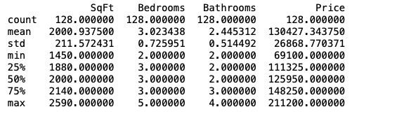
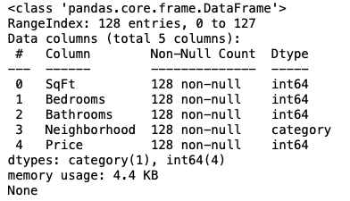
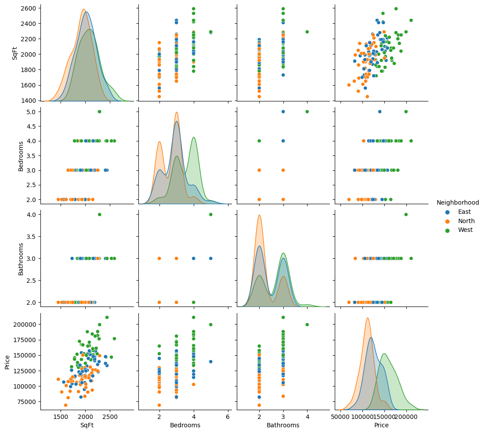
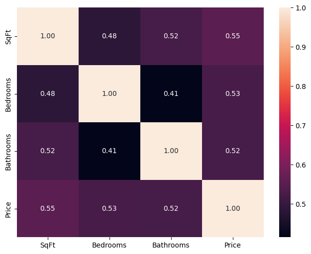
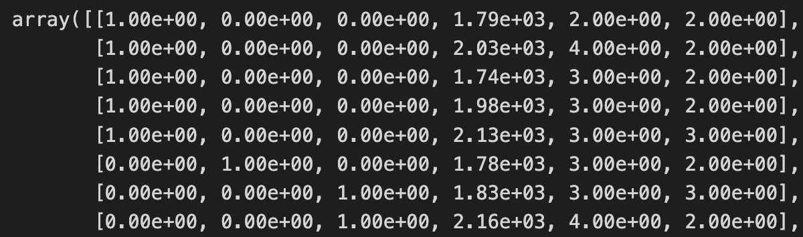
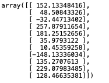
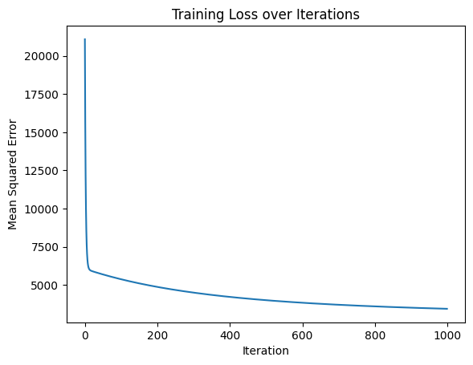
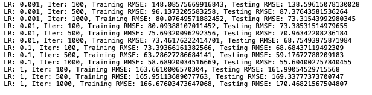
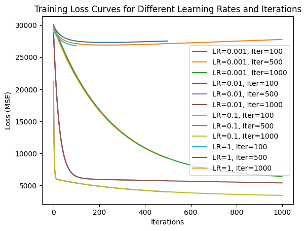

#### Problem 1

**Step 1:** After having a look with `df.info()` and `df.describe()`, the output shows as follows:





The dataset contains 128 entries and 5 attributes: `SqFt`, `Bedrooms`, `Bathrooms`, `Neighborhood`, and `Price`. The `Neighborhood` feature is **categorical**, and the rest are numerical. Houses range from 1450 to 2590 square feet, with 2 to 5 bedrooms and 2 to 4 bathrooms. Prices vary significantly, from 69,100 to 211,200. There are no missing values like `NaN` or `null`, and the dataset occupies 4.4 KB of memory.

**Step 2:** After some visualization, the output shows as:

     

The pairplot indicates that **larger square footage, more bedrooms, and more bathrooms** are all moderately associated with higher house prices. The distribution of points suggests that **the neighborhood** also influences house prices, with some neighborhoods appearing to have consistently higher or lower prices.

The heatmap confirms **moderate positive correlations** between house size, number of bedrooms, number of bathrooms, and price， with the correlation coefficients all above 0.5 but not so high.

**Step 3:** After performing the transformer using `ColumnTransformer`, we transfer the previous data set into the following `df_encoded`, with the first three column as one-hot encoding representing *Neighbourhood*, followed by the rest as *SqFt*, *Bedrooms* and *Bathrooms*. Here is part of the array:



After that, we randomly split the data with `train test split` into two parts for later analysis.

**Step 4:** By executing the linear regression using `model.fit` and `model.predict`, we report the **training RMSE** to be 14067.463277743977 and the **testing RMSE** to be 16099.659294811487, which seems to be a valid and accurate match.

#### Problem 2

Because I have re-run the jupyter notebook before submission, some figures here might be a bit different than that in the notebook.

**Step 1:** As instructed, we load the diabetes dataset. To better coordinate with the matrix operations, I add to `X` an additional first column of all ones, functioning as the intercept. Also,  `y` is converted into an 2D array.

With reference, the learning rate`lr = 0.1` and `iteration = 1000` are chosen for the problem. `m` indicates the rows of the design matrix with intercept `X_b`, and `w` is initialized to be $w_i \sim N(0, 1)$.

For the step of gradient descent, the gradient $\frac{2}{m} X_b^T (w^T X_b - y)$ is implemented as

```python
gradients = 2 / m * X_b.T.dot(X_b.dot(w) - y)
```

and update as $w := w - \alpha \nabla f(\mathbf{x})$. Here, `2` is intentionally used here because it will empirically provide a better visualization than that of `1`.

The result shows as:   

**Step 2:** After splitting the whole dataset into two, I run the linear regression again on the test set. This time a list `train_loss` is initialized, and for each iteration the loss is appended:

```python
loss = mean_squared_error(y_train, X_train.dot(w))
train_loss.append(loss)
```

After the training, we generate both the prediction of training set and that on the test set, `y_train_pred` and `y_test_pred`, after which the RMSE is calculated respectively:  The **training RMSE** is roughly 58.672, and the **testing RMSE** is 55.583. The plot looks as below on the left.



**Step 3:** In this part, I tuned different hyper-parameter of gradient descents, which are **learning rate** `LR` and iterations `Iter`. The only difference lies in encapsulating the steps into the `gradient_descent ` function, and add two `for` iterations for every experiment. The result tells that:



with the corresponding curves as above on the right.



From the plot the influnces of these hyper-parameters could be analysed:

+ **Iterations:** A sufficent number of iterations often yields a complete gradient descent, but it will be a waste of resources if this number is too large. An iteration of 600 could have been enough.
+ **Learning rate:** If the learning rate is too large, the step might be so large that it steps over the optima all the time. If the learning rate is too small, it might take such a huge number of iterations to descend to the optima. A learning rate of 0.1 seems good.