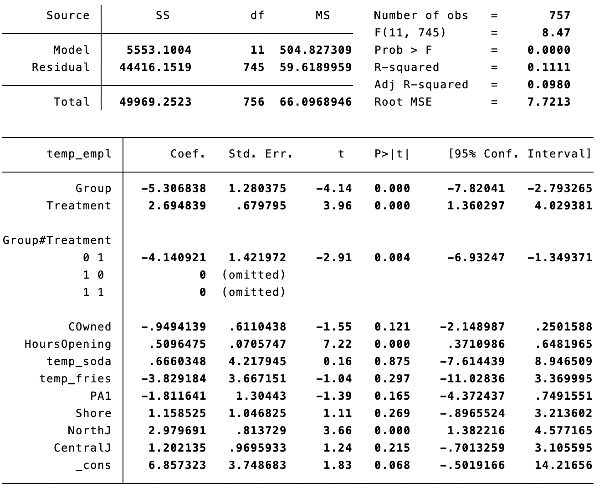

<h3 align="center">ECO3121 Problem Set 4</h3>
<div align="center">Xue Zhongkai (122090636)</div>

#### Question 1

1. As $Z_{it}=Z_t$, the variable $Z_i$ is the same for the same land parcel but specific for the time, hence it could be a variable like **climate characteristic for the year or specific policy at the time**.

   Estimation method:

   + Method I: Introduce a fixed-effect variable $\alpha_t$, re-write the model as

     $$Crop_{it} = \beta_0 + \beta_1 X_{it} +\alpha_t +\gamma_t +u_{it}$$

     Then we substract the entity average of time from it to remove the land-fixed effect:

     $$Crop_{it}-\bar{Crop_{it}} = \beta_1 (X_{it}-\bar{X_{it}})+\alpha_t -\bar{\alpha_t}+\gamma_t -\bar{\gamma_t}+u_{it}-\bar{u_{it}}$$

     which is the demeaned equation:

     $\tilde{Crop_{it}} = \beta_1 \tilde{X_{it}}+\tilde{u_{it}}$

      Now we could estimate coefficients by regressing $\tilde{Crop_{it}}$ on $\tilde{X_{it}}$.

   + Method II: Set the first year ($t=1$) as the base, and re-write the model in binary regression form:

     $$Crop_{it} = \beta_0 + \beta_1 X_{it} +\sum_{i=2}^{N}\alpha_t D_{t} +\gamma_t +u_{it}$$

     Here $\sum_{t=2}^{N}\alpha_t D_{t}$ is the sum for time-fixed effect, and $D_t=1$ for the $t$th year but $0$ for other times.

     Finally we could estimate the coefficients by OLS. 

2. As $Z_{it}=Z_i$ , the variable $Z_t$ is the same for all years but specific for land parcels, hence it could be a variable like **quality, position or size of the land parcels**.

   Estimation method:

   + Method I: Introduce a fixed-effect variable $\alpha_i$, re-write the model as

     $$Crop_{it} = \beta_0 + \beta_1 X_{it} +\alpha_i +\gamma_t +u_{it}$$

     Then we substract the entity average of time from it to remove the land-fixed effect:

     $$Crop_{it}-\bar{Crop_{it}} = \beta_1 (X_{it}-\bar{X_{it}})+\gamma_t -\bar{\gamma_t}+u_{it}-\bar{u_{it}}$$

     which is the demeaned equation:

     $\tilde{Crop_{it}} = \beta_1 \tilde{X_{it}}+\tilde{\gamma_t}+\tilde{u_{it}}$

      Now we could estimate coefficients by regressing $\tilde{Crop_{it}}$ on $\tilde{X_{it}}$ and $\tilde{\gamma_t}$.

   + Method II: Set the first land parcel ($i=1$) as the base, and re-write the model in binary regression form:

     $$Crop_{it} = \beta_0 + \beta_1 X_{it} +\sum_{i=2}^{N}\alpha_i D_{i} +\gamma_t +u_{it}$$

     Here $\sum_{i=2}^{N}\alpha_i D_{i}$ is the sum for land-fixed effect, and $D_i=1$ for the $i$th land parcel but $0$ for others. 

     Finally we could estimate the coefficients by OLS. 

#### Question 2

1. We could write difference-in-difference estimator as

   $$\text{DiD} = (Y_{i}^1|_{D_i=1}-Y_{i}^1|_{D_i=0})-(Y_{i}^0|_{D_i=1}-Y_{i}^0|_{D_i=0})$$

   $Y_{i}^1|_{D_i=1}$: The crop of the land parcel in Gansu province, after the attack.

   $Y_{i}^0|_{D_i=1}$: The crop of the land parcel in Gansu province, before the attack.

   $Y_{i}^1|_{D_i=0}$: The crop of the land parcel in non-Gansu province, after the attack.

   $Y_{i}^0|_{D_i=0}$: The crop of the land parcel in non-Gansu province, before the attack.

2. The assumption of parallel trends: In the absence of the attack (free fertilizer), the average change in the crop would have been the same for the land parcel within and without Gansu province.

3. Under this circumstance, the DiD estimator will over-estimate the effect of the treatment (free fertilizer). 

   Farmers in Gansu province working harder but  not taken into account of the regression, will lead to a typical Omitted Variable Bias (OVB). In other words, the increase in crops results from not only the treatment observed (free fertilizer), but also the omitted variable (farmers working harder). Thus the effect of the treatment will be over-estimated.

#### Question 3

Here are a summary of the scenario:

| Location     | Treatment                  |
| ------------ | -------------------------- |
| New Jersey   | Increase: \$4.25 to \$5.05 |
| Pennsylvania | (Control Group)            |

1. Comparing New Jersey vs. PA after the change in the minimum wage may not be a good estimation, because there could be many other factors influencing the employment, as the two states vary in aspects like economic conditions, taxation policy and consumer preferences. Only if these differences are controlled will we assure whether the increase in employment results from the minimun wages.

2. Here is the regression with entity and time fixed effect:

   $Empl_{it} = \beta_0 + \beta_1 Treatment_t + \beta_2 Group_i + \beta_3 (Treatment_t \times Group_i) + \gamma X_{it} + \epsilon_{it}$

   where $X_{it}$ is the set of control variables.

3. The assumption of parallel trends: In the absence of the treatment (increase in minimum wage), the average change in the employment would have been the same in New Jersey and PA.

4. First we import the `.csv` file:

   ```stata
   import delimited "/Users/kevinshuey/Github/coursework/eco3121/as4/DID_Example.csv"
   ```

   Then we do some pre-process on some `str` data:

   ```stata
   gen temp_empl = real(Empl)
   gen temp_soda = real(Soda)
   gen temp_fries = real(Fries)
   ```

   Finally we perform the regression:

   ```stata
   . reg temp_empl Group Treatment Group#Treatment COwned HoursOpening /*
   			*/	temp_soda temp_fries PA1 Shore NorthJ CentralJ 
   ```

   I believe the ordinary `chain` is meaningless, thus I didn't include it. Also I omitted `PA2`, `SouthJ` in case of collinearity.

   And here is the result:

   

5. With the assumption of parallel trends, the employment trends in New Jersey and Pennsylvania were similar prior to the policy intervention.  After the implementation of the policy, any changes in the difference between the two states can be attributed to the increase in the minimum wage. By comparing these differences i.e. DiD, we can control for other factors hence get an unbiased estimation.

